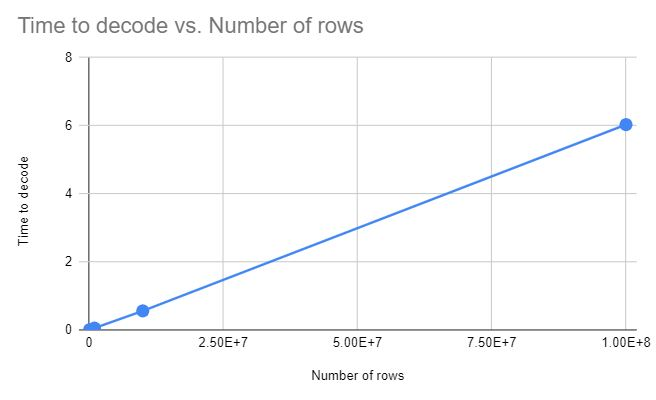

# Dictionary Encoder

## Encoder Implementation

### Overview
The encoder is implemented using c++. The process is split into two steps. First, the input file is split into several chunks to be processed by multiple threads.
Each thread goes through the chunk line by line, and adds each string found to a hash set (`std::unordered_set`).
After each thread completes it's chunk, the sets are combined into a single hash table (`std::unordered_map`), with a numeric index identifying each unique string. Finally, the main thread uses this table to create the encoded file. The encoded file has the following format:
```
Number of Dictionary Entries (N)
Dict entry 0
Dict entry 1
|
|
|
Dict entry N-1
Entry 0 number
Entry 1 number
Entry 2 number
|
|
|
Entry M-1 number
```

The main thread outputs the number of dictionary entries, and the string representation for each index. Then, the text entries of the file are replaced with their textual representation.

### Code Structure
`void process_file(std::string fn, size_t byte_offset, size_t length, int index, std::vector<std::unordered_set<std::string>> &sets)`
The function `process_file` goes through the file specified by `fn`. Starting at the provided `byte_offset`, it finds the start of the next line if it isn't at one already. Then, line by line each element is added to the hash set until it reaches `byte_offset + length` bytes into the file. The `index` tag is used to uniquely identify the threads. Finally, `sets` is a vector of all the hash sets that the threads are filling.

`void output_file(std::string input_fn, std::string out_fn, std::unordered_map<std::string, int> &map, std::vector<std::string> &words)`
The function `output_file` performs the above described output. `input_fn`is used to re-read the data lines to ouptut the corresponding entries to `out_fn`. `map`contains the mapping from string to integer representation. The vector`words`contains the dictionary entries in order, to easily create the header for the output file.


## Parser Implementation
There are two main parts to this program, the decoding and querying. Firstly the encoded file generated will be decoded and 2 `std::vector`s will be generated, one containing the words that were in the encoded dictionary, and another one containing how many times the word was repeated. The word and the number of repetitions will be at the same index as each of these `std::vector` should be the exact same size. Due to this fact when you want to find information about the word, only the index of one of the vectors is needed to access the info associated with the same word in the other vector.

When querying, there are two options available. The first option is checking to see if a word exist. This is implemented by a simple linear search with `std::find` through the words and returning an index that is used to find the number of repetitions. This is an O(n) operation at worst. The second option is finding the word at the index of the `std::vector` and displaying it with how many times it was repeated. This is a O(1) operation as it is only needs to point at the index of the vectors twice.

## Compiling and Running the Code

### cmake on Linux
1.  Create a folder named  `build`  in the same directory as the CMakeLists.txt file
2.  Change into the folder (e.g.  `$ cd build`)
3.  Run cmake to compile in release mode:  `$ cmake ..`
4.  Build by running  `$ make`
    1.  Can run  `make`  in parallel with the  `-j`  flag, eg  `$ make -j8`
5.  Run the executables `project4_encode` and `project4_parse` 

### g++ on Linux
1. Change to the `Project4` directory
2. For encoder: `g++ encode.cpp -pthread -std=c++17 -o project4_encode`
3. For parser: `g++ decode.cpp -o project4_parse`

### Generating Test Files
Dictionary encoders are ideal to use on datasets with low cardinality. To create datasets of this type, the dictionary file `words_alpha.txt` and the python script `gen_input_file.py` are used. The dictionary file contains a list of possible words to use in the data that will be passed to the encoder.

Run `python3 gen_input_file.py dictionary_file out_file mean_words std_words mean_num std_num`
This generates out_file, which has N unique words, with mean of `mean_words`and standard deviation of `std_words`. The amount of each word has mean `mean_num` and standard deviation `std_num`. For example, to use 100 unique words, each with a mean number of 1000 and standard deviation of 100 into out.txt, run `python3 gen_input_file.py words_alpha.txt out.txt 100 0 1000 100`

### Running the code
To run the encoder, pass the file to be encoded as the first argument, the output filename as the second argument, and the number of threads as the third argument. For example:
`./project4_encode out.txt encoded.txt 1`will encode `out.txt` into `encoded.txt` and only use 1 thread to parse the file.

### Runnning the parser
To Run the parser, all that is needed is to pass the encoded file that should have been generated previously. For example `./project4_parse encoded.txt` will take the encoded file, decode it, and will prompt you with instructions on querying the file.

## Encoder Performance Results


### Encoding - Single Thread
For a single thread parsing, the following input data sizes were tested for encoding. The input data was generated using `collect_encode_data.sh`.
| Number of rows | Time to encode |
|----------------|----------------|
|         100000 |          0.152 |
|        1000000 |          1.518 |
|       10000000 |          15.14 |
|      100000000 |        153.677 |


### Encoding - Multiple Threads
For the data size 100000000, the following number of threads was tested. The input data was generated using `collect_encode_data.sh`.
| Num threads | time to encode (Size 100000000) |
|-------------|---------------------------------|
|           1 |                         205.062 |
|           2 |                         180.934 |
|           4 |                         170.995 |
|           8 |                         168.883 |
|          16 |                         169.216 |


### Analysis and Conclusion
We observe that, unsurprisingly, under a single thread that the time to encode increases linearly with the size of the input. That is because the dictionary parser is implemented in O(n). We scan through the file twice, both O(n) operations. The first time, we add elements to a hash set, which is constant time. The second time, we read from the hash set, which is also constant time. 

We don't see much improvement from the threading. That is likely due to the fact that while we can parse the file the first time with multiple threads, since we need to output to a single file in the second part we only use one thread. In this case, as opposed to the file compression lab previously, it didn't make sense to have multiple worker threads do the conversion then have the main worker copy to the output file since the operation is much simpler than compression; just a constant time hash table lookup. 
This could be improved by changing our encoding format: instead if we had multiple "encoded" files, that would allows us to split up the output step into several threads as well.

## Parser Performance Results

### Decoding
For a single thread decoding, the folling results were observed when decoded a dictionary that had N number of rows.
| Number of rows | Time to decode |
|----------------|----------------|
|         100000 |          0.006 |
|        1000000 |          0.053 |
|       10000000 |          0.558 |
|      100000000 |          6.031 |



### Querying (word lookup)


| Number of querys| Time to query |
|----------------|----------------|
|         1000 |          0.006 |
|        10000 |          0.47 |
|       100000 |         44.835 |


### Querying (index lookup)
| Number of querys| Time to query |
|----------------|----------------|
|         1000 |          0.000002 |
|        10000 |          0.000014 |
|       100000 |         0.000129 |

### Analysis and Conclusion
We observed as stated that the decoding and the word look up query are both O(n) as both of the graphs show a linear trend with the exeption of the word lookup query where the graph may be not be the best quality due to the lack of datapoints. The index lookup is O(1) as stated (despite the increase in time, on the same scale as the word lookup this would be a constant line). 
